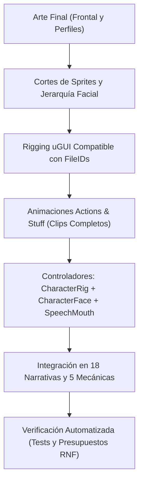

# Plan Maestro: Personajes Finales, Animaciones "Actions & Stuff", Vista de Perfil, Expresiones y Animación de Habla

> **Destinatario:** Santiago Benavides Rey  
> **Proyecto:** Algoritmia (Unity 6000.5.10f1, URP 17.6.0, uGUI Canvas Overlay)  
> **Módulos impactados:** `Game.Scaffolding`, `Game.UI`, `Game.Levels.*`, Assets de Arte y Animación, 18 Narrativas y 5 Escenas Jugables.  
> **Estado:** Especificación técnica lista para ejecución directa paso a paso.
>
> **Actualización del 05/10/2026.** Las **Fases 2 y 3 están hechas** en el código y el generador
> (commit `a12dbb3`, rama `feat/personajes-animados`), a falta del arte final y de la verificación
> en el Editor: los prefabs y los clips todavía no se han regenerado. Lo que hizo y lo que
> difiere de este plan está en `Personajes-Resultados.md`, Anexo C. Decisiones de Santiago del
> mismo día: codos y rodillas, Algoritm articulado y sin cuello (§3.1), y los nombres de sprites
> vigentes (§4.2 y §7, que sustituyen aquí a `Front/` y `frente_`; INC-131). Siguen **pendientes**
> los perfiles (`CharacterOrientation`, Fase 4.4), el retrato animado del cuadro de diálogo
> (4.1) y poblar emociones en los 18 `N*_*.asset`.
>
> **Actualización posterior del 05/10/2026 (INC-132).** En la familia los brazos se dibujan detrás del
> torso y delante de la cabeza, salvo al golpear (`Strike`, 06/10: `ArmLayering` los pasa delante del
> torso y los devuelve al cambiar de acción), y en Algoritm delante del cuerpo con las manos sobre la
> cara (modo `"orden"` de `BuildRigsFinal.cs.txt`; **hasta INC-147, 09/10/2026: ver la nota del final de esta cabecera**); la coreografía de
> Fase 3 se escribe ahora en `herramientas/coreografia.py` (→ `clips_personajes.json`) en vez de en
> el C#, y `herramientas/preparar_arte_final.py` es la entrada del arte final. Detalle en
> `Personajes-Resultados.md`, C.9. Este plan no se reescribe.
>
> **Actualización del 06/10/2026 (INC-133).** Este plan no se reescribe; esta nota fija lo que cambió.
> (1) El arte de cada personaje se reparte en subcarpetas `Frontal/`, `Expresiones/` y `Perfil/`
> (`OrganizarArtePersonajes.cs.txt`, `63ed2fc`); el árbol de §7 (hacia la línea 307) sitúa
> `char_<x>_cara.asset` y las partes en la raíz de la carpeta del personaje, y hoy el set de cara es
> `<Art>/<Carpeta>/Expresiones/char_<x>_cara.asset`. (2) Los originales de la entrega del 06/10/2026
> están en `claudeDocs/tasks/Personajes/entregas/2026-10-06/` (`d26ea8f`). (3) Las caras de la familia
> se colocan por registro (`preparar_expresion.py --registrada`, `233f2e5`), no por la heurística de
> escala. (4) INC-133: en la familia el húmero va detrás del torso y el antebrazo delante del torso,
> de la cara y de las piernas, con `AnclaAntebrazoX` y `LimbFollower` (`ef37dd9`); acota la regla de
> INC-132 en la familia, que sigue vigente para `Strike` y, hasta INC-147, para Algoritm. Entró el arte final frontal de
> Papá, Mamá, Niña y Niño; falta el de Algoritm, y la ronda del Editor (nodos, sprites, orden, clips,
> pruebas `INC133`, capturas) está pendiente. Detalle en `Personajes-Resultados.md`, C.10.
>
> **Actualización del 08/10/2026 (ronda de ajustes de diseño).** Este plan no se reescribe; esta nota
> fija lo que cambió. (1) **Algoritm ya se dibuja por partes con arte provisional**: nueve piezas por
> forma recortadas de su `_reposo` (`pose_preview.py --exporta-maqueta`, 27 PNG en `Frontal/`), con
> `Cuerpo` apagado; `Ojos` y `Boca` siguen apagados porque la cara va en el torso. Cuando llegue su arte
> final se sustituyen los PNG con el mismo nombre y se corren `sprites`, `orden` y `clips`. (2) El
> enum `ActorAction` **ya no está intacto** (§7, árbol de archivos): gana `Wave = 22`, el saludo de
> Algoritm en los créditos (emoción `Happy`), y Algoritm pasa de 9 a **10 clips** (§7 dice 9). (3) Papá:
> el húmero sube y el antebrazo baja (`codo.py`) para que no asome por el codo. (4) `CharacterRig.idlePhase`
> desfasa el `Idle` de los cinco personajes de la portada. Detalle en `Personajes-Resultados.md`, C.12.
> **Quedan pendientes para el arte final de Algoritm (decisión D20, no se corrigen antes):** los
> anillos oscuros en las rótulas durante los fundidos (`Appear`, `Vanish`, `Hidden`), porque el alfa del
> `CanvasGroup` multiplica cada `Image` por separado donde se solapan, y el talón claro de unos 12 px en
> el hombro girado; se revisan con el arte nuevo. El corte en nueve piezas es del arte provisional y lo
> sustituirá la ingesta del diseño nuevo de Algoritm (INC-136) que hace el carril de perfil; el prompt
> para meterla está en `Prompt-Arte-Final-Algoritm.md`.
>
> **Actualización del 09/10/2026 (INC-134 a INC-136).** Este plan no se reescribe; esta nota fija lo que
> cambió. Detalle en `Personajes-Resultados.md`, C.13.
>
> **Perfil (§4, Fase 4.4 y casilla 2.4): ejecutado; rondas 1 y 2 del Editor hechas.** Llegó el
> arte de perfil de Papá, Mamá, la Niña y el Niño y Santiago decidió que el personaje se ve de perfil
> siempre que recorre o trabaja el entorno (INC-134). Difiere del plan así: (1) **no existe
> `CharacterOrientation`** (`Front`, `ProfileLeft`, `ProfileRight`) ni un `Facing` del rig: la vista la decide
> la **acción** (`ActionView` → `CharacterView { Front, Profile }`, `CharacterRig.View` de solo lectura) y
> el lado lo decide `Heading.FacesLeft`, con la regla «izquierda o arriba, a la izquierda; derecha o abajo,
> a la derecha; en una diagonal, el eje dominante»; (2) **hay un solo arte de perfil, mirando a la
> derecha**, y el perfil izquierdo es `CharacterRig.Mirrored` sobre el lienzo, solo en perfil: es la
> «simetría controlada» que §4.2 dejaba como alternativa, con la asimetría de peinados y prendas que §4.1
> señalaba, aún sin revisar en capturas; la entrega llegó mirando a la izquierda y la ingesta la espeja;
> (3) la carpeta es `Perfil/` y no `Profile/`, y las piezas son diez más la cara, con los nombres
> `char_<x>_perfil_*` de C.13, no los seis del árbol de §4.2; (4) **el orden de dibujo de §4.3 está
> corregido: las dos piernas van siempre detrás del torso** (Santiago, 09/10/2026), y todo cuelga de un solo
> `Perfil/Tronco` con el pivote en la cadera: brazo lejano, pierna lejana, pierna cercana, torso, cuello y
> cabeza, brazo cercano; (5) los cuerpos se buscan por ruta, sin campo serializado, y un rig sin torso de
> perfil con sprite (Algoritm) se queda de frente; (6) las columnas «Vista» de las tablas de §8 son
> orientativas: el motor calcula el lado por el desplazamiento de cada paso y `ActorBeat.Facing` (`Auto`,
> `Left`, `Right`) lo fija a mano donde el guion lo pida, y ninguno de los 18 assets lo declara hoy;
> (7) Mamá, en el río, gira también con las flechas de arriba y de abajo (Fase 4.4). Papá, de cara al
> montón, y la Niña, de cara a la caja, son añadidos de esta ejecución.
>
> **Cara y parpadeo (§5.2): dos cuadros (INC-135).** El arte final trae ojos abiertos y ojos cerrados, sin
> cuadro medio: `CharacterFaceSet.Eyes(Half)` devuelve el cerrado cuando falta el medio, y el parpadeo
> enseña los ojos cerrados sus 0,12 s completos. `CharacterFace` gana una cara de perfil opcional
> (`profileEyes`, `profileMouth`, `profileFaceSet`) que comparte el reloj de parpadeo y de habla de la de
> frente. Hoy **solo parpadea el perfil**: falta el cuadro cerrado de frente, pedido al artista.
>
> **Algoritm (§3.1 y §7): diseño nuevo oficial, ya aplicado (INC-136).** El artista entregó a Algoritm en
> tres siluetas —llama, disco de madera y gota— con pantaloneta de cuadros, y Santiago decidió que es el
> definitivo. Entró en **siete piezas por forma** (torso, húmero, antebrazo con la mano y pierna entera con
> el pie), **sin rodilla**, con codos, sin cuello ni cabeza, sustituyendo en su sitio al corte provisional
> de nueve: lo de §3.1 sobre las rodillas de Algoritm y los nombres `parte_pierna`/`parte_antepierna` de §7
> no se cumplen para él. Escala que conserva la altura de hoy (`preparar_algoritm.py`), cara provisional del
> sprite anterior hasta que llegue la del artista, y los tres `_reposo` rehechos en su sitio.
>
> **Ronda 2 del Editor (09/10/2026, `f20b271`): hecha.** `perfil` dejó las piernas detrás del torso en los
> cuatro prefabs de la familia y `sprites` aplicó el arte final de Algoritm en sus tres formas, sin perder ni
> cambiar ningún fileID. `suite2.ps1`: EditMode 710 de 711 (1 omitida), PlayMode 417/417. Las capturas (144,
> en JPEG) están en `claudeDocs/tasks/Personajes/capturas/2026-10-09/` (`0212469`). Detalle, las tres
> correcciones del generador y los límites de la revisión en `Personajes-Resultados.md`, C.13.
>
> **Peso medido (09/10/2026):** el build sobre `0212469` pesó 499,3 MB frente al tope de 500 MB (RNF-06); por decisión de
> Santiago cinco props del N1 pasaron a 256 px (INC-146) y el paquete pesa 420,6 MB, con 79,4 MB de margen. Son
> medidas, no un candidato del OE4 (`Personajes-Resultados.md`, C.13).
>
> **Actualización del 09/10/2026 (INC-147).** Este plan no se reescribe; esta nota fija lo que cambió. Por
> decisión de Santiago, los brazos de Algoritm se dibujan **detrás de todo el cuerpo**: el orden bajo
> `Lienzo/Cuerpo/Tronco` es `BrazoIzq`, `BrazoDer`, `Torso`, `Ojos`, `Boca`, y no `Torso`, `Ojos`, `Boca`,
> `BrazoIzq`, `BrazoDer` (las manos sobre la cara de INC-132, que aquí se cita en la nota del 05/10/2026
> y en §3.1). Revierte esa cláusula solo para el guía; la regla de la familia (INC-132 e INC-133) no cambia.
> `pose_preview.py` mide el antebrazo y el húmero del guía como los de la familia y registra tres
> excepciones de la forma de rueda (`Celebrate`, `Encourage` y `Wave`: con el brazo en alto, el húmero
> queda tras el disco). Entró en `a44ca96`; la ronda del Editor del modo `"orden"` sobre los tres prefabs
> está en curso. Detalle en `Personajes-Resultados.md`, C.14.
>
> **Siguen pendientes:** la medida de RNF-04 y RNF-05 en un ejecutable (próximo candidato del OE4); los ojos cerrados de frente;
> la cara de Algoritm; el retrato animado del cuadro de diálogo (4.1) y poblar emociones en los 18
> `N*_*.asset`.

---

## 1. Resumen Ejecutivo y Objetivos

Este plan maestro establece la hoja de ruta definitiva para sustituir los personajes provisionales por los **personajes finales** de la familia (Papá, Mamá, Niña, Niño) y el guía Algoritm en *Algoritmia*. La implementación abarca:

1. **Estilo de Animación "Actions & Stuff":** Inspirado en la famosa dirección de animación dinámica de Minecraft, adaptando al recorte 2D principios de animación viva: *squash & stretch* controlado (≤ 15% según DA §13.2), anticipación elástica, *body lean* (inclinación según aceleración), *secondary motion* (inercia orgánica en pelo y ropa) y *settle/overshoot* en paradas.
2. **Vista de Perfil (Izquierda y Derecha):** Arte y rigging específico para vistas laterales de los personajes, resolviendo problemas de asimetría (cabello, ropajes, herramientas) que no pueden solucionarse con un simple volteo negativo de escala ($x = -1$). Vital para `Level3_River` (Mamá recolectando en la orilla) y planos narrativos conversacionales.
3. **Sistema de Expresiones Faciales:** Ojos, cejas y bocas modulares capaces de expresar emociones acordes al guion (Neutra, Alegría, Sorpresa, Concentración/Esfuerzo, Preocupación, Sueño) tanto en el modelo en escena como en el retrato del cuadro de diálogo (`Portrait`).
4. **Animación de Habla (Lip-Sync / Mouth Flaps):** Animación de apertura y cierre de boca rítmica, procedural y reactiva mientras el texto se imprime y se lee la línea, con cese inmediato al terminar.
5. **Corrección Definitiva del T-Pose:** Análisis del fallo en el ciclo de vida del `CharacterRig` y los clips actuales, con la solución de código ya aplicada y directrices para los clips futuros.



---

## 2. Diagnóstico y Corrección de las Poses en T (T-Pose)

### 2.1 Causa Raíz Identificada
El comportamiento donde los personajes a menudo quedaban congelados en pose en T (A-pose de recorte original) se debía a tres factores combinados:

1. **Ciclo de vida en `CharacterRig.cs` desincronizado con Unity uGUI:**
   - Cuando un actor se instanciaba en `PlaceActor` (`NarrativeSceneController`), se llamaba a `rig.Play(prop.ActorStart)`. Si el GameObject aún no había completado su primer ciclo de activación o estaba inactivo en jerarquía, `animator.isActiveAndEnabled` era `false`.
   - El código anterior ejecutaba `_started = true; Current = action; if (!animator.isActiveAndEnabled) return;`.
   - Cuando el Animator finalmente se activaba y la narrativa pedía la acción `Idle` de la línea 0, `Apply` encontraba `action == Current && _started` y salía inmediatamente sin ordenar al Animator reproducir nada. El Animator permanecía en su estado no evaluado: la pose en T del prefab.
2. **Pérdida de estado al desactivar/activar jerarquías (`m_KeepAnimatorStateOnDisable: 0`):**
   - En Unity, los prefabs de personajes tienen `m_KeepAnimatorStateOnDisable: 0`. Al cerrar y abrir menús de pausa o alternar paneles de interfaz, el `Animator` se resetea internamente. Al carecer `CharacterRig` de un callback `OnEnable()`, no re-sincronizaba la animación activa y `_started` seguía en `true`, bloqueando la recuperación.
3. **Clips incompletos y `writeDefaultValues = true`:**
   - Clips como `char_papa_anim_animo`, `char_papa_anim_senalar` o `char_papa_anim_hablar` solo tenían curvas para el brazo derecho o el torso.
   - En Unity, cuando un clip no tiene curvas para un hueso (como el brazo izquierdo o las piernas), `writeDefaultValues` restablece esos huesos a sus valores del prefab (rotación $0^\circ$), provocando que durante esas animaciones la extremidad contraria caiga bruscamente en pose en T rígida.

### 2.2 Solución en Código Implementada en `CharacterRig.cs`
Se implementó en `Assets/Game/Scripts/Runtime/Scaffolding/CharacterRig.cs`:
- **`OnEnable()`:** Fuerza el reajuste del lienzo (`Fit(true)`) y la re-sincronización inmediata del estado actual (`Apply(Current, immediate: true)`).
- **`Start()`:** Garantiza que cualquier personaje colocado estáticamente en escenas mecánicas (cueva, bosque, taller, laberinto, río) inicie inmediatamente su animación sin depender de que un script externo lo despierte.
- **`Apply(action, immediate)` con snap frame 0:** Para el primer fotograma (`!_started`) o al reactivarse, se invoca `animator.Play(state, 0, 0f)` seguido de `animator.Update(0f)`. Esto obliga a Mecanim a evaluar la pose de inmediato, suprimiendo la mezcla de 0.18 s desde la pose en T vacía.

---

## 3. Principios "Actions & Stuff" en Recorte 2D (uGUI)

"Actions & Stuff" destaca porque cada acción se siente viva, elástica y natural. Aunque en Minecraft se aplica sobre un rig 3D cúbico, sus leyes visuales se traducen de forma idéntica al sistema de recorte 2D de *Algoritmia*:

| Principio | Manifestación en "Actions & Stuff" | Implementación en Rig 2D de Algoritmia |
|---|---|---|
| **Squash & Stretch** | El personaje se comprime al tocar el suelo y se estira en el impulso. | Modulación de `Cuerpo.localScale` en Y ($0.92$ a $1.08$) y compensación en X ($1.04$ a $0.96$) para conservar volumen. Dentro del límite del 15% (DA §13.2). |
| **Anticipation** | Antes de martillar, golpear o saltar, hay un retroceso preparatorio. | En `Strike`, `Hammer` y `PickUp`, retroceder el torso y el brazo opuesto antes del impacto. |
| **Secondary Motion** | Mechones de pelo, bordes de la túnica y brazos oscilan desfasados. | Curvas secundarias en cabeza, pelo y extremidades con retraso de 2 a 4 frames respecto al tronco. |
| **Body Lean (Inclinación)** | Al caminar o correr, el torso se inclina hacia adelante; al frenar, hacia atrás. | En `Walk` y `Run`, inclinación de `Cuerpo.localEulerAngles.z` ($-4^\circ$ a $-8^\circ$). Al detenerse, oscilación amortiguada (*settle*). |
| **Alive Idle (Respiración y Micro-movimientos)** | El reposo nunca es una estatua congelada. | Ciclo de respiración en `Idle` de 3.2 s combinando elevación sutil de hombros, balanceo de peso entre piernas y micro-parpadeo. |
| **Bending Limbs (Articulación fluida)** | Extremidades que no parecen varillas rígidas. | Separación de piernas y brazos en dos tramos (brazo/antebrazo y muslo/pantorrilla) o solapamiento circular con contorno limpio. |

### 3.1 Codos, rodillas y Algoritm articulado, sin cuello (decisión de Santiago, 05/10/2026)

Esto **no estaba en el plan maestro** y lo añade la decisión del 05/10/2026 (INC-131):

- **Familia.** Cada extremidad va en **dos sprites**: húmero y antebrazo, muslo y antepierna. Hay
  articulaciones en **codos y rodillas**, además de hombros, cadera y **cuello**, y la cabeza se
  separa del torso con los ojos y la boca en capas propias.
- **Algoritm** (las tres formas: fuego, rueda y gota) también: brazos, piernas, codos y rodillas en
  dos tramos, y ojos y boca **sobre el cuerpo**. **No tiene cuello ni cabeza**: en `hablar`, el
  gesto lo lleva el tronco.
- **Mientras no llegue el arte**, codos, rodillas y cuello son **pivotes vacíos** y las capas nuevas
  van apagadas: el arte provisional se ve igual. Los nodos se **añaden** a los siete prefabs sin
  reconstruirlos (regla de los fileID) y sus posiciones viven en
  `herramientas/rig_articulaciones.json`, provisional (`Personajes-Resultados.md`, C.2 y C.3).
- **Rodillas en vista frontal.** La flexión ocurre en profundidad: el muslo se abre hacia fuera y la
  antepierna se cierra hacia dentro y se acorta con la escala Y de la rodilla, no con un giro plano.
  Los codos sí giran en el plano. Con el arte actual (sin segmentar) se mantiene el truco de escalar
  la pierna entera en `Kneel` y `Sleep`; con las piernas partidas, ningún clip escala las piernas.

---

## 4. Vista de Perfil (Izquierda y Derecha)

### 4.1 Justificación Técnica
Actualmente, los personajes son frontales. Cuando caminan hacia los lados, el motor aplica `Mirrored = true` (escala $x = -1$). Esto provoca:
1. Las figuras caminan "de frente" mientras se deslizan lateralmente.
2. Los peinados asimétricos (como el de Mamá o la Niña) y las prendas con detalles a un costado se invierten incorrectamente.
3. En la mecánica del río (`Level3_River`), Mamá camina por la orilla y debería verse claramente de lado transportando troncos y herramientas.

### 4.2 Matriz de Orientaciones y Sprites
Cada miembro de la familia dispondrá de tres vistas maestras:
- **Frontal (`Front`):** Para situaciones estáticas, explicaciones y escenas ceremoniales.
- **Perfil Derecho (`ProfileRight`):** Mirando hacia la derecha (vista canónica de avance en 2D).
- **Perfil Izquierdo (`ProfileLeft`):** Mirando hacia la izquierda (o derivado mediante simetría controlada si el diseño no posee asimetrías críticas).

> **Corrección del 05/10/2026 (INC-131).** La vista frontal **no lleva carpeta `Front/` ni el
> nombre `frente_`**: sus partes se quedan en la carpeta del personaje con los nombres vigentes
> (`char_<x>_parte_*`, con el mismo GUID), a los que se añaden `antebrazo`, `antepierna` y `cabeza`,
> y la cara (`char_<x>_ojos_*`, `char_<x>_boca_*`) vive en la misma carpeta, sin `Face/`. La tabla
> de nombres está en `Personajes-Resultados.md`, C.4. Los **perfiles siguen sin ejecutarse**: su
> árbol, abajo, es el del plan original y se revisará cuando se aborden.

```
Assets/Game/Art/Characters/{Father,Mother,Girl,Boy}/
├── char_<id>_parte_torso.png            (vigente)
├── char_<id>_parte_cabeza.png           (nuevo)
├── char_<id>_parte_brazo_izq.png        (vigente; ahora el húmero)
├── char_<id>_parte_brazo_der.png
├── char_<id>_parte_antebrazo_izq.png    (nuevo)
├── char_<id>_parte_antebrazo_der.png
├── char_<id>_parte_pierna_izq.png       (vigente; ahora el muslo)
├── char_<id>_parte_pierna_der.png
├── char_<id>_parte_antepierna_izq.png   (nuevo)
├── char_<id>_parte_antepierna_der.png
├── char_<id>_ojos_{neutra,alegria,sorpresa,preocupacion,concentracion,sueno}.png
├── char_<id>_ojos_parpadeo_{medio,cerrado}.png
├── char_<id>_boca_{0,a,e,u}.png
├── char_<id>_boca_{alegria,sorpresa,preocupacion,concentracion}.png
└── Profile/                             (pendiente, sin ejecutar)
    ├── char_<id>_perfil_torso.png
    ├── char_<id>_perfil_cabeza.png
    ├── char_<id>_perfil_brazo_cercano.png
    ├── char_<id>_perfil_brazo_lejano.png
    ├── char_<id>_perfil_pierna_cercana.png
    └── char_<id>_perfil_pierna_lejana.png
```

### 4.3 Jerarquía de Capas en Perfil (Depth Sorting)
Para la vista de perfil, el orden de dibujo (de atrás hacia adelante en uGUI) debe ser:
1. `Sombra` (contacto inferior)
2. `BrazoLejano` (brazo del fondo)
3. `PiernaLejana` (pierna del fondo)
4. `PiernaCercana` (pierna cercana, **también detrás del torso**)
5. `Cuerpo/Tronco` (torso de perfil)
6. `Cabeza` (con cara de perfil)
7. `BrazoCercano` (brazo en primer plano)

> **Corregido el 09/10/2026 (INC-134).** La primera versión de esta lista ponía `PiernaCercana` delante del
> torso (después del paso 4 actual). Santiago decidió que las dos piernas van siempre detrás del torso,
> como de frente. En el motor todo cuelga de `Lienzo/Perfil/Tronco` y la `Sombra` sigue siendo la de la
> familia (C.13).

---

## 5. Sistema de Expresiones Faciales y Habla Dinámica

> **Nota del 05/10/2026.** Lo implementado (`Personajes-Resultados.md`, C.7) difiere en poco de
> este apartado: el parpadeo es `BlinkClock` y no `ProceduralBlink`, y baja y sube pasando por
> medio → cerrado → medio; el habla es `MouthFlap` dentro de `CharacterFace`, sin
> `SpeechMouthController`; la boca de `Worried` es «apenas curvada», nunca una mueca de llanto
> (CP-02), y no «curvada abajo»; y `Encourage` lleva `Happy`. Los sprites de ojos y bocas se llaman
> como en §4.2, uno por cada valor de `FacialEmotion` salvo las bocas de `Neutral` y `Sleeping`, que
> usan `boca_0`. **El retrato del cuadro de diálogo aún no usa la cara** (Fase 4.1).

### 5.1 Arquitectura de Expresiones
Para dotar a los personajes de expresividad sin aumentar drásticamente el peso de texturas (cumpliendo con RNF-06 < 500 MB):

```
Cabeza (RectTransform)
├── Cara_Base (Piel y forma de la cabeza)
├── Ojos (Image: Sprite Swap de emociones + parpadeo)
└── Boca (Image: Sprite Swap de fonemas y emociones)
```

#### Emociones Faciales (`FacialEmotion`):
```csharp
public enum FacialEmotion
{
    Neutral = 0,    // Mirada serena, boca cerrada relajada
    Happy = 1,      // Ojos achinados sonrientes, cejas altas, sonrisa
    Surprised = 2,  // Ojos abiertos grandes, cejas arriba, boca en "O"
    Worried = 3,    // Cejas inclinadas hacia el centro, boca curvada abajo
    Focused = 4,    // Mirada concentrada, cejas bajas (al golpear o martillar)
    Sleeping = 5    // Ojos cerrados con pestañas curvas hacia abajo
}
```

### 5.2 Parpadeo Automático Procedural (`ProceduralBlink`)
Un componente ligero acoplado al GameObject de la cabeza:
- Genera un parpadeo espontáneo cada $3.5\text{ s} \pm 1.2\text{ s}$.
- La animación de parpadeo dura exactamente $0.12\text{ s}$ (3 fotogramas: Abierto $\to$ Medio $\to$ Cerrado $\to$ Abierto).
- Se deshabilita automáticamente si la emoción activa es `Sleeping`.

### 5.3 Animación de Habla (Lip-Sync / Mouth Flap)
Para sincronizar el habla con el diálogo sin requerir pistas de audio fonéticas complejas:
1. **Detección de voz:** Cuando `CharacterRig.Speaks(currentSpeaker)` es verdadero en una línea de diálogo:
   - El rig activa el estado `ActorAction.Talk` (gestualidad corporal y balanceo de cabeza).
   - El componente `SpeechMouthController` inicia el bucle de fonemas.
2. **Ciclo de Fonemas (4 bocas clave):**
   - `Boca_0`: Cerrada / Reposo.
   - `Boca_A`: Apertura amplia (vocales abiertas A, O).
   - `Boca_E`: Apertura ancha / media (vocales E, I).
   - `Boca_U`: Pequeña y redondeada (U, consonantes labiales M, B, P).
3. **Comportamiento en UI Diálogo:**
   - El retrato en el marco de diálogo (`Portrait`) implementa el mismo sistema de parpadeo y apertura de boca, dando coherencia cinematográfica a las conversaciones.

---

## 6. Plan de Ejecución Paso a Paso

### Fase 1: Creación de Arte Final y Hojas de Partes
- [ ] **1.1 Diseñar sprites finales en estilo A&S:** Diseñar en vector/alta resolución frontal y perfil de Papá, Mamá, Niña, Niño y Algoritm (fuego, rueda, gota).
- [ ] **1.2 Exportar partes de recorte:** Torso, cabeza, brazos, antebrazos, piernas y accesorios respetando pivotes anatómicos naturales.
- [ ] **1.3 Exportar láminas de rostros:** Sprites de ojos (6 emociones + 2 fases de parpadeo) y bocas (4 fonemas + 4 emociones).
- [ ] **1.4 Limpieza de bordes y canales alfa:** Ejecutar `arte_check.py halo` para garantizar cero halos verdes de croma (conservando la aprobación de calidad de la entrega).

> **Nota (05/10/2026).** Los nombres de las partes y de la cara que debe entregar 1.2 y 1.3 son los
> de `Personajes-Resultados.md`, C.4 y `Assets/Game/Art/Inventario.md`: `parte_cabeza`,
> `parte_antebrazo_*`, `parte_antepierna_*`, `ojos_*` y `boca_*`; `parte_brazo_*` es el húmero y
> `parte_pierna_*` el muslo. Algoritm entrega lo mismo con el prefijo
> `char_algoritm_<fuego|rueda|gota>_`, sin cabeza.

### Fase 2: Actualización de Scripts y Componentes Runtime (`Game.Scaffolding`)
*Hecha el 05/10/2026 (commit `a12dbb3`); falta la verificación en el Editor.*
- [x] **2.1 Crear `FacialEmotion.cs`:** Declarar el enum de emociones.
  - Hecho, con los valores del §5.1. Se añadió `ActionEmotion.cs` (C# plano): la emoción que lleva
    cada `ActorAction` cuando el guion no fija otra.
- [x] **2.2 Crear `CharacterFace.cs`:** MonoBehaviour encargado de gestionar los sprites de ojos y boca en tiempo de ejecución.
  - Hecho. Se apoya en dos clases nuevas de C# plano, `BlinkClock` y `MouthFlap`, y en un
    ScriptableObject, `CharacterFaceSet` (CT-05). Sin set o sin sprite, la `Image` queda apagada.
- [x] **2.3 Crear `SpeechMouthController.cs`:** Controlador del ritmo de fonemas mientras el texto se reproduce.
  - **Difiere:** no existe ese archivo. El ritmo vive en `MouthFlap` (cicla A, E, U y cerrada a
    0,09 s, sin azar) y lo ejecuta `CharacterFace`; el parpadeo del §5.2, que el plan llama
    `ProceduralBlink`, es `BlinkClock`.
- [x] **2.4 Extender `CharacterRig.cs`:** *(la emoción y el habla; los perfiles quedan pendientes)*
  - [x] Agregar soporte para la emoción. **Difiere:** en lugar de `FacialEmotion CurrentEmotion
    { get; set; }`, `CharacterRig` tiene `EmotionOverride` (`FacialEmotion?`), `Emotion` (el
    override o, si no hay, la de la acción) y `Speaking`.
  - [ ] Agregar soporte para `CharacterOrientation Facing { get; set; }` (Front, ProfileLeft, ProfileRight).
    **NO se hizo:** queda pendiente con los perfiles (§4 y Fase 4.4).
  - [x] Mantener intactas las firmas públicas y métodos probados (`Play`, `PlayFor`, `Speaks`, `Current`).
- [x] **2.5 Extender `ActorBeat.cs` y `NarrativeProp.cs`:**
  - Permitir declarar opcionalmente `Emotion` por beat en los assets de narrativa.
  - Hecho en `ActorBeat` (`SetsEmotion`, `Emotion`, `WithEmotion`), `ActorCue` (`Emotion`) y
    `ActorTimeline.EmotionAt`; `NarrativeProp` no cambió, porque ya guarda los `Beats`.
    `NarrativeSceneController` aplica la emoción de la línea y mueve la boca de quien habla.
    **Pendiente:** poblar emociones explícitas en los 18 `N*_*.asset` (`SetsEmotion` vale `false`
    por defecto, así que hoy ninguno cambia) y el retrato del cuadro de diálogo (Fase 4.1).

### Fase 3: Generación de Clips de Animación Completos
*Hecha el 05/10/2026 en el generador (commit `a12dbb3`); los clips **aún no se han regenerado**: lo hace la sesión local en el Editor.*
*Nota posterior (05/10/2026, INC-132): la coreografía pasó del C# a `coreografia.py` y el generador solo aplica `clips_personajes.json`; el Idle es de 6,4 s (dos respiraciones de 3,2 s). Ver `Personajes-Resultados.md`, C.9.*
- [x] **3.1 Crear script editor `BuildRigsFinal.cs`:**
  - Basado en `BuildRigs.cs.txt`, pero con modo `"clips"` que reescribe únicamente las curvas sin cambiar los FileIDs de los prefabs.
  - **Difiere:** se versiona como `herramientas/BuildRigsFinal.cs.txt` (se copia al Editor para correrlo y se borra) y no tiene un modo sino cinco: `"nodos"` (añade los nodos y el `CharacterFace` a los 7 prefabs), `"sprites"` (asigna el arte final), `"clips"`, `"todo"` y `"estado"`. Lee la tabla `rig_articulaciones.json`, que se estima con `articulaciones.py`.
- [x] **3.2 Clavar todas las propiedades básicas en cada clip:**
  - Garantizar que clips como `Idle`, `Walk`, `Run`, `Talk`, `Strike`, `Hammer`, `Point`, `Encourage`, `Celebrate` tengan curvas explícitas para todos los huesos del rig (evitando que `writeDefaultValues` provoque caídas a pose en T).
  - Cada clip lleva rotación en todos los huesos de su personaje (12 en la familia, 10 en Algoritm); uno sin uso queda constante en su pose de reposo.
- [x] **3.3 Incorporar curvas elásticas de "Actions & Stuff":**
  - Aplicar tangentes `ClampedAuto` y curvas armónicas para el balanceo y rebote elástico.
  - Respiración de 3,2 s, inclinación al caminar y correr, anticipación, asentamiento, estirar y aplastar de hasta el 15 % y movimiento secundario de la cabeza con 2 a 4 cuadros de retraso.

### Fase 4: Integración en Escenas y Niveles
- [ ] **4.1 Escena Narrativa (`NarrativeSceneController`):**
  - Conectar el retrato con `CharacterFace` para que el cuadro de diálogo muestre emociones y mueva la boca al hablar.
- [ ] **4.2 Nivel 1 (Cueva - Fuego):**
  - Papá con animación fluida de golpeo de pedernales, soplado con rebote orgánico e idle atento.
- [ ] **4.3 Nivel 2 (Bosque, Taller, Laberinto):**
  - La Niña empujando con *body lean*, martilleo enérgico con anticipación, observación con balanceo.
- [ ] **4.4 Nivel 3 (Río - Balsa):**
  - Mamá utilizando la **vista de perfil** al caminar por la orilla a izquierda y derecha, celebraciones con *squash & stretch*.

### Fase 5: Pruebas, Verificación y Presupuestos
- [ ] **5.1 Pruebas de Regresión:**
  - Ejecutar suite EditMode de `CharacterRigTests` (los 23 casos existentes deben pasar en verde).
  - Ejecutar `ActorTimelineTests` (los 24 casos deben mantenerse intactos).
- [ ] **5.2 Verificación de Presupuestos (RNF-04..RNF-06):**
  - Carga de escena < 10 s.
  - Memoria RAM en ejecutable < 2 GB.
  - Tamaño del paquete portable < 500 MB (Sprite Atlases comprimidos en Crunch / DXT5 / ASTC).
  - *Estado (09/10/2026):* **RNF-06 medido** con `oe4.ps1 Tamano`, 499,3 MB y, con INC-146, 420,6 MB; la casilla sigue abierta porque **RNF-04 y RNF-05 no se han medido** en un ejecutable. El arte entra sin comprimir (`ArtImportRules`), no con Crunch.
- [ ] **5.3 Capturas de Verificación Visual:**
  - Ejecutar `Personajes_DA133_CapturaCadaMecanicaConSusPersonajes` y validar que ningún fotograma exhiba pose en T.

---

## 7. Inventario y Nomenclatura de Archivos

> **Corregido el 05/10/2026 (INC-131):** sin `Front/` ni `Face/`; los nombres vigentes y los
> archivos de código que de verdad existen. `SpeechMouthController.cs` no se creó (§6, 2.3).

```
Assets/Game/
├── Art/
│   └── Characters/
│       ├── Father/
│       │   ├── char_papa_parte_*.png   (torso, cabeza, brazo/antebrazo, pierna/antepierna)
│       │   ├── char_papa_ojos_*.png · char_papa_boca_*.png
│       │   ├── char_papa_cara.asset    (CharacterFaceSet; lo crea el modo "sprites")
│       │   ├── Profile/ (partes de perfil; pendiente)
│       │   └── Animations/ (21 clips .anim + char_papa.controller)
│       ├── Mother/
│       ├── Girl/
│       ├── Boy/
│       └── Algoritm/
│           ├── char_algoritm_<fuego|rueda|gota>_parte_*.png · _ojos_*.png · _boca_*.png
│           ├── char_algoritm_<fuego|rueda|gota>_cara.asset
│           └── Animations/ (9 clips .anim + char_algoritm.controller)
├── Prefabs/
│   └── Characters/
│       ├── Papa.prefab (fileIDs originales preservados)
│       ├── Mama.prefab
│       ├── Nina.prefab
│       ├── Nino.prefab
│       ├── Algoritm_Fuego.prefab
│       ├── Algoritm_Rueda.prefab
│       └── Algoritm_Gota.prefab
└── Scripts/Runtime/
    └── Scaffolding/
        ├── CharacterRig.cs (OnEnable/Start/Play inmediato; EmotionOverride, Emotion, Speaking)
        ├── CharacterFace.cs (ojos y boca sobre dos Image)
        ├── CharacterFaceSet.cs (sprites y tiempos de la cara; ScriptableObject)
        ├── FacialEmotion.cs · ActionEmotion.cs (enum y emoción por acción)
        ├── BlinkClock.cs · MouthFlap.cs (parpadeo y aleteo de la boca; C# plano)
        ├── ActorAction.cs (enum intacto)
        ├── ActorBeat.cs · ActorCue.cs
        └── ActorTimeline.cs
```

> [!IMPORTANT]
> **Regla de Oro de Integración:** Nunca se deben eliminar ni regenerar los archivos `.prefab` desde cero. Se debe usar la técnica de preservación de FileIDs (añadiendo componentes o editando curvas con `"clips"`), tal como se documentó en las actas D09 y D10, para asegurar que los 18 assets narrativos y las 5 escenas no pierdan sus referencias serializadas.


---

## 8. Catálogo y Coreografía Detallada de Animaciones según la Narrativa (18 Secuencias + 5 Mecánicas)

Esta sección constituye la **guía maestra de animación y puesta en escena**. Detalla, secuencia por secuencia y línea por línea, qué hace cada personaje, qué vista corporal utiliza, qué emoción facial transmite y cómo se aplican los principios elásticos de **"Actions & Stuff"** (A&S).

```
Convenciones de Orientación:
- Frontal: Personaje orientado hacia la cámara (diálogos reflexivos, explicaciones, asombro).
- Perfil Izquierdo: Cuerpo orientado hacia la izquierda (avance hacia atrás, huida, repliegue).
- Perfil Derecho: Cuerpo orientado hacia la derecha (avance principal, exploración, persecución).
```

---

### 8.1 Nivel 1: El Fuego (4 Secuencias Narrativas + Mecánica Cueva)

#### Secuencia 1: `N1_Apertura` (7 líneas) — La Huida en la Noche Helada
* **Contexto dramático:** Noche helada sin luna. La familia camina aterida de frío y asustada, escuchando sombras amenazantes en la maleza, hasta que corren despavoridos y se refugian en la cueva a oscuras.
* **Personajes en escena:** Papá, Mamá, Niña, Niño.

| Línea & Texto Clave | Personaje | Acción (`ActorAction`) | Vista Corporal | Emoción Facial | Directiva de Animación "Actions & Stuff" |
|---|---|---|---|---|---|
| **L00** "Noche helada, sin luna..." | Papá, Mamá, Niña, Niño | `Walk` *(se desplazan a x=0.76..0.84)* | **Perfil Izq** | `Worried` | Caminata encorvada contra el viento gélido. Torso inclinado, hombros altos, temblor sutil en el ciclo de pisada. |
| **L01** "Se escuchan ruidos extraños..." | Papá | `Point` | **Perfil Izq** | `Worried` | Brazo tenso señalando la maleza; retroceso preparatorio de cabeza antes de estirar el brazo. |
| **L01** | Mamá, Niña | `Observe` | **Perfil Izq / 3/4** | `Worried` | Mano en el pecho, mirada fija e inquieta hacia el origen del sonido. |
| **L01** | Niño | `Surprise` | **Frontal** | `Surprised` | Sobresalto con micro-salto en el sitio; brazos pegados al torso, ojos dilatados. |
| **L02** "Algo se acerca... corren!" | Papá, Mamá, Niña, Niño | `Run` *(huyen a x=0.43..0.48)* | **Perfil Izq** | `Worried` | *Body lean* agresivo ($12^\circ$). Zancada amplia con estiramiento elástico de piernas y mechones de pelo ondeando hacia atrás con desfase. |
| **L03-L05** "Entran a la cueva..." | Papá, Mamá, Niña, Niño | `Walk` *(avanzan a x=0.28..0.33)* | **Perfil Izq** | `Focused` | Desaceleración progresiva (*overshoot* de parada). Pasos cautelosos y sigilosos; respiración agitada en el torso. |
| **L06** "Solo oscuridad." | Familia | `Idle` | **Frontal** | `Neutral` | Cese de movimiento, siluetas que se funden a negro. |

---

#### Secuencia 2: `N1_Hallazgo` (18 líneas) — El Descubrimiento de las Piedras
* **Contexto dramático:** En la penumbra de la cueva, el Niño encuentra las piedras en el suelo; la Niña las hace chocar generando la primera chispa de la historia; Papá toma el control y amontona las hojas secas.
* **Personajes en escena:** Papá, Mamá, Niña, Niño.

| Línea & Texto Clave | Personaje | Acción (`ActorAction`) | Vista Corporal | Emoción Facial | Directiva de Animación "Actions & Stuff" |
|---|---|---|---|---|---|
| **L02** "El niño se arrodilla y busca..." | Niño | `Walk` $\to$ `Kneel` | **Perfil Izq** | `Focused` | Agachamiento suave doblando rodillas, apoyando las dos manos en el suelo en busca de las piedras. |
| **L04** "La niña las toca también..." | Niña | `Walk` $\to$ `PickUp` | **Perfil Izq** | `Focused` | Flexión de cintura con anticipación elástica hacia arriba antes de agacharse a recogerlas. |
| **L05** "Las golpea una contra otra..." | Niña | `Strike` | **Frontal** | `Focused` | Golpeteo rítmico: los brazos retroceden en arco y chocan frente al pecho con un retroceso seco y elástico. |
| **L06** "¡CLIC! Un destello pequeñísimo..." | Mamá, Niño, Niña | `Surprise` | **Frontal** | `Surprised` | Sobresalto colectivo sincronizado: torsos arqueados hacia atrás, ojos bien abiertos, boca en 'O'. |
| **L08** "¡Sí! ¡Otra vez, otra vez!" | Niño | `Celebrate` | **Frontal** | `Happy` | Rebote elástico en tobillos con puños al aire; *squash* al caer sin despegar pies del suelo. |
| **L11** "Quédense con mamá, atrás..." | Papá | `Point` | **Perfil Der** | `Focused` | Brazo extendido con firmeza protectora. Postura firme y plantada. |
| **L11** | Mamá, Niño, Niña | `Walk` *(retroceden a x=0.36..0.40)* | **Perfil Der** | `Neutral` | Retroceso ordenado; los niños caminan mirando hacia atrás con curiosidad. |
| **L12** "Mamá lo toma del hombro..." | Mamá | `Hug` | **Frontal** | `Happy` | Abrazo suave y contenedor rodeando los hombros del Niño para calmar su inquietud. |
| **L14-L15** "Papá amontona las hojas..." | Papá | `Walk` $\to$ `Kneel` $\to$ `PickUp` | **Frontal / 3/4** | `Focused` | Transición continua de caminata a rodillas, reuniendo el montón con movimientos pausados y seguros. |

---

#### Secuencia 3: `N1_AparicionGuia` (11 líneas) — El Nacimiento de Algoritm
* **Contexto dramático:** En la negrura absoluta brota una chispa dorada que cobra vida: nace Algoritm Fuego, flotando y danzando en el aire para mostrarles el secreto del fuego.
* **Personajes en escena:** Papá, Mamá, Niña, Niño, Algoritm_Fuego.

| Línea & Texto Clave | Personaje | Acción (`ActorAction`) | Vista Corporal | Emoción Facial | Directiva de Animación "Actions & Stuff" |
|---|---|---|---|---|---|
| **L00** "Un pequeño destello amarillo..." | Algoritm_Fuego | `Appear` | **Frontal** | `Happy` | Nace desde un punto luminoso que se infla con *squash & stretch* rotacional y pulso de partículas. |
| **L01** "Flotando frente a la familia..." | Algoritm_Fuego | `Idle` | **Frontal** | `Happy` | Flotación armónica senoidal vertical ($24\text{ px}$) con balanceo pendular suave. |
| **L04** "La niña abre mucho los ojos..." | Niña, Niño | `Surprise` | **Frontal** | `Surprised` | Ojos gigantescos, barbilla caída, manos abiertas a los lados. |
| **L05** "Mamá y papá se miran..." | Papá, Mamá | `Surprise` | **Perfil (mutuo)** | `Surprised` | Giro de cabeza mirándose el uno al otro con expresión de desconcierto mágico. |
| **L06** "Gira como un trompo feliz..." | Algoritm_Fuego | `Spin` *(se desplaza a x=0.21)* | **Frontal** | `Happy` | Giro vertiginoso de $360^\circ$ con deformación vertical en la cima y estela de puntos brillantes. |
| **L06** | Niño | `Celebrate` | **Frontal** | `Happy` | Aplaude y salta en el sitio fascinado con el baile del guía. |
| **L07** "Avanza hacia el fondo..." | Familia (4) | `Walk` *(siguen al guía)* | **Perfil Izq** | `Happy` | Caminata ligera y curiosa siguiendo el brillo dorado de Algoritm. |
| **L08** "¿Ven esa piedra gris? Es sílex..." | Algoritm_Fuego | `Point` | **Perfil Izq** | `Focused` | Inclinación acusada en el aire apuntando hacia las piedras del suelo. |
| **L10** "Algoritm parpadea y se esfuma..." | Algoritm_Fuego | `Vanish` | **Frontal** | `Neutral` | Parpadeo rítmico que encoge progresivamente su silueta hasta disolverse en el aire. |

---

#### Secuencia 4: `N1_NacimientoDelFuego` (17 líneas) — La Conquista del Calor
* **Contexto dramático:** La fogata arde con fuerza. La cueva se inunda de luz y calor. La familia corre emocionada a abrazar a Papá. Algoritm imparte la primera lección sobre "iterar" y la familia descansa unida.
* **Personajes en escena:** Papá, Mamá, Niña, Niño, Algoritm_Fuego.

| Línea & Texto Clave | Personaje | Acción (`ActorAction`) | Vista Corporal | Emoción Facial | Directiva de Animación "Actions & Stuff" |
|---|---|---|---|---|---|
| **L02** "Papá se queda quieto, arrodillado..." | Papá | `Kneel` | **Frontal** | `Happy` | Respiración profunda y aliviada; hombros que caen relajados mientras sus ojos brillan con el reflejo de la llama. |
| **L03** "¡PAPÁAA! ¡LO LOGRASTE!" | Niña, Niño | `Celebrate` | **Frontal** | `Happy` | Brazos en alto, balanceo de júbilo con amplia sonrisa. |
| **L04** "Los niños salen corriendo hacia él..." | Niña, Niño | `Run` *(hacia Papá)* | **Perfil Izq** | `Happy` | Carrera desbocada con balanceo de brazos enérgico, frenando en seco sobre Papá. |
| **L04** | Mamá | `Walk` *(se acerca)* | **Perfil Izq** | `Happy` | Caminata apresurada y maternal con sonrisa radiante. |
| **L05** "Papá los abraza a todos..." | Papá, Niña, Niño, Mamá | `Hug` | **Frontal** | `Happy` | Abrazo colectivo cálido: brazos que rodean con fuerza, meciéndose lentamente al compás del fuego. |
| **L08** "En el fuego aparece Algoritm..." | Algoritm_Fuego | `Appear` | **Frontal** | `Happy` | Emerge triunfal desde el centro de la fogata. |
| **L10** "El niño celebra..." | Niño | `Celebrate` | **Frontal** | `Happy` | Brincos alegres alrededor de la fogata. |
| **L12** "Papá la abraza más fuerte..." | Papá, Niña | `Hug` | **Frontal** | `Happy` | Contacto íntimo padre e hija con compresión suave de torsos. |
| **L15** "Algoritm se recoge dentro..." | Algoritm_Fuego | `Vanish` | **Frontal** | `Neutral` | Se sumerge suavemente en las brasas. |
| **L16** "Esa noche la familia duerme unida..." | Familia (4) | `Sleep` | **Frontal / Suelo** | `Sleeping` | Reposo colectivo sobre el pasto/suelo, respiración lenta y sincronizada de $4.0\text{ s}$. |

---

#### 8.1.5 Mecánica: `Level1_Cave` (Chispa, Amontonado y Soplado)
* **Papá (`player`):**
  - Al tomar cada pieza de pedernal: `PickUp` con flexión de cadera y anticipación elástica ($0.35\text{ s}$).
  - Al pulsar "Golpear": `Strike` potente (brazos retroceden $60^\circ$ y chocan con micro-vibración en el impacto).
  - Tras un golpe sin chispa: `Encourage` (puño alzado de determinación, sin derrota según CP-02).
  - Al converger: `Blow` agachado con contracción torácica ($0.9\text{ s}$), pasando a `Kneel` atento mirando nacer el fuego.
* **Familia al fondo (`family`):**
  - Mamá y Niña en `Idle` respirando suavemente.
  - Niño inquieto en `Observe` con manos a la cintura y cuerpo inclinado adelante observando a Papá.
* **Algoritm Fuego:** En el botón de pista/ayuda flotando con micro-oscilación.

---

### 8.2 Nivel 2: La Rueda (7 Secuencias Narrativas + 3 Mecánicas)

#### Secuencia 5: `N2_PuenteI` (3 líneas) — La Salida de la Cueva
* **Contexto dramático:** Amanecer azulado. La familia sale de la cueva al exterior. Algoritm les plantea la necesidad de buscar comida.
* **Personajes:** Papá, Mamá, Niña, Niño, Algoritm_Fuego.

| Línea & Texto Clave | Personaje | Acción (`ActorAction`) | Vista Corporal | Emoción Facial | Directiva de Animación "Actions & Stuff" |
|---|---|---|---|---|---|
| **L00** "Amanece. Salen de la cueva..." | Familia (4) | `Walk` *(salen a la derecha)* | **Perfil Der** | `Neutral` | Caminata coordinada en fila hacia el claro del bosque; respiración fresca de mañana. |
| **L00** | Algoritm_Fuego | `Appear` | **Frontal** | `Happy` | Emerge flotando por encima de la entrada de la cueva. |
| **L01** "Para cocinar, necesitan comida..." | Mamá, Niña | `Observe` | **Perfil Der** | `Focused` | Mirada atenta hacia la espesura del bosque. |
| **L02** "Comida." | Mamá | `Point` | **Perfil Der** | `Focused` | Mano extendida marcando el horizonte del bosque. |
| **L02** | Niño | `Celebrate` | **Frontal** | `Happy` | Entusiasmo infantil al pensar en buscar alimento. |

---

#### Secuencia 6: `N2_PuenteI_Bosque` (9 líneas) — La Carga Imposible
* **Contexto dramático:** La familia recolecta en el bosque. Papá carga troncos gigantescos y no puede más; el Niño intenta arrastrarlo y se atasca; la Niña comprende que la fuerza no es la solución, sino la forma.
* **Personajes:** Papá, Mamá, Niña, Niño, Algoritm_Rueda.

| Línea & Texto Clave | Personaje | Acción (`ActorAction`) | Vista Corporal | Emoción Facial | Directiva de Animación "Actions & Stuff" |
|---|---|---|---|---|---|
| **L00** "La familia sale a recolectar..." | Familia (4) | `Walk` / `Run` | **Perfil Der** | `Neutral` | El Niño corre adelante explorando; los padres caminan atentos. |
| **L01** "Papá carga grandes troncos..." | Papá | `Carry` *(se desplaza cargando)* | **Perfil Der** | `Focused` | Brazos en V sosteniendo troncos; paso pesado con flexión marcada de rodillas y quejido corporal. |
| **L01** | Mamá, Niña, Niño | `PickUp` | **Frontal / 3/4** | `Focused` | Recolección de bayas y ramas en el suelo. |
| **L03** "No pueden transportarlo todo..." | Papá | `Push` | **Perfil Der** | `Worried` | Intento de empujar la pila en el suelo; inclinación de $15^\circ$, pies resbalando sutilmente. |
| **L05** "¡Yo puedo arrastrarlo!" | Niño | `Encourage` | **Frontal** | `Happy` | Puño alzado con entusiasmo desmedido. |
| **L06** "Lo intenta. Se atasca en la tierra..." | Niño | `Push` $\to$ `Encourage` | **Perfil Der** | `Focused` | Esfuerzo inútil empujando; se detiene exhausto pero motivado a buscar otra forma. |
| **L08** "¿Y si el problema es la forma?" | Niña | `Observe` $\to$ `Point` | **Frontal** | `Focused` | Mano al mentón reflexionando; mirada iluminada al concebir la idea. |
| **L08** | Algoritm_Rueda | `Appear` | **Frontal** | `Happy` | Aparece por primera vez con su forma de Rueda de madera flotando. |

---

#### Secuencia 7: `N2_Escena21_Bosque` (7 líneas) — Observar y Filtrar
* **Contexto dramático:** Frente a objetos dispersos en el suelo (piedras, troncos, ramas). La familia intenta mover una caja pesada de víveres. Algoritm enseña a no fijarse en todo, sino en lo útil.
* **Personajes:** Papá, Mamá, Niña, Niño, Algoritm_Rueda.

| Línea & Texto Clave | Personaje | Acción (`ActorAction`) | Vista Corporal | Emoción Facial | Directiva de Animación "Actions & Stuff" |
|---|---|---|---|---|---|
| **L01** "La caja que no logran mover..." | Papá | `Push` *(hacia la caja)* | **Perfil Der** | `Focused` | Fuerza concentrada contra la caja de alimentos sin que esta ceda. |
| **L03** "Algunas cosas se mueven más fácil..." | Mamá | `Point` | **Perfil Der** | `Focused` | Señala con delicadeza los troncos cilíndricos caídos. |
| **L04** "Voy a probar todas!" | Niño | `Run` *(hacia objetos)* | **Perfil Der** | `Happy` | Carrera traviesa hacia los objetos del suelo. |
| **L05** "Solo lo que realmente funciona..." | Niña | `Observe` | **Frontal** | `Focused` | Postura analítica, evaluando las formas de las piedras y troncos. |
| **L05** | Niño | `PickUp` | **3/4** | `Focused` | Prueba levantar una piedra áspera que rueda mal. |

---

#### Secuencia 8: `N2_Escena22_ElPatron` (7 líneas) — El Descubrimiento del Patrón
* **Contexto dramático:** La caja rueda sobre los troncos cilíndricos. La familia experimenta: la piedra no rueda, los troncos sí. Descubren el patrón: lo redondo rueda.
* **Personajes:** Papá, Mamá, Niña, Niño, Algoritm_Rueda.

| Línea & Texto Clave | Personaje | Acción (`ActorAction`) | Vista Corporal | Emoción Facial | Directiva de Animación "Actions & Stuff" |
|---|---|---|---|---|---|
| **L00** "La caja rueda sobre los troncos..." | Niña | `Push` *(avanza la caja)* | **Perfil Der** | `Happy` | Empuje fluido y liviano; el torso acompaña el avance de la caja sin sobreesfuerzo. |
| **L00** | Algoritm_Rueda | `Spin` | **Frontal** | `Happy` | Gira rodando alegremente por encima de la caja. |
| **L01** "¡Este tronco rueda!" | Niño | `PickUp` *(muestra tronco)* | **Frontal** | `Happy` | Muestra el tronco en alto con orgullo infantil. |
| **L02** "Pero esa piedra no..." | Papá | `PickUp` *(muestra piedra)* | **Frontal** | `Worried` | Sostiene una piedra angular comparándola con perplejidad. |
| **L04** "Los que ruedan... son redondos." | Niña | `Observe` $\to$ `Point` | **Frontal** | `Happy` | Conexión lógica brillante: cejas arriba, sonrisa de eureka. |
| **L05** "Acabas de encontrar un patrón." | Niño, Niña | `Celebrate` | **Frontal** | `Happy` | Celebración coordinada con brazos arriba y rebote elástico. |

---

#### Secuencia 9: `N2_Escena23_Construccion` (8 líneas) — Paso a Paso
* **Contexto dramático:** La familia decide crear una herramienta con ruedas. Algoritm desglosa la construcción de la carretilla paso a paso.
* **Personajes:** Niña, Papá, Niño, Mamá, Algoritm_Rueda.

| Línea & Texto Clave | Personaje | Acción (`ActorAction`) | Vista Corporal | Emoción Facial | Directiva de Animación "Actions & Stuff" |
|---|---|---|---|---|---|
| **L00** "Si hacemos algo redondo..." | Niña | `Point` | **Frontal** | `Focused` | Señala hacia el banco de trabajo imaginando la carretilla. |
| **L02** "¡Probemos!" | Niño | `Celebrate` | **Frontal** | `Happy` | Brinco elástico motivador. |
| **L04-L07** "Abre agujeros... únelos... tabla..." | Algoritm_Rueda | `Idle` *(se desplaza marcando pasos)* | **Frontal** | `Focused` | Desplazamiento rítmico en 4 paradas, señalando las piezas que se van ensamblando. |
| **L04** | Mamá | `Walk` *(hacia materiales)* | **Perfil Der** | `Focused` | Acomoda los insumos ordenadamente. |

---

#### Secuencia 10: `N2_Escena24_Regreso` (8 líneas) — El Algoritmo de la Ruta
* **Contexto dramático:** La carretilla está lista, pero transportarla al refugio requiere esquivar piedras y curvas. Algoritm enseña a planificar y ordenar la secuencia antes de ejecutar.
* **Personajes:** Papá, Niña, Niño, Mamá, Algoritm_Rueda.

| Línea & Texto Clave | Personaje | Acción (`ActorAction`) | Vista Corporal | Emoción Facial | Directiva de Animación "Actions & Stuff" |
|---|---|---|---|---|---|
| **L02** "Empujar..." | Papá | `Push` | **Perfil Der** | `Focused` | Apoya las manos en los manillares de la carretilla. |
| **L03** "Girar..." | Niño | `Point` | **Perfil Der** | `Happy` | Gesto dinámico indicando el cambio de dirección. |
| **L04** "Evitar la piedra..." | Mamá | `Point` | **Perfil Der** | `Worried` | Señala con cautela las rocas del camino. |
| **L05** "Ordenar bien los pasos..." | Niña | `Observe` | **Frontal** | `Focused` | Visualiza mentalmente el laberinto. |
| **L06** "Lleva la carretilla al refugio..." | Algoritm_Rueda | `Idle` *(vuela guiando)* | **Frontal** | `Happy` | Guía el recorrido flotando sobre el inicio de la senda. |

---

#### Secuencia 11: `N2_Escena25_Cierre` (6 líneas) — El Triunfo de la Rueda
* **Contexto dramático:** Noche en el refugio. La carretilla descansa repleta de alimentos junto al fuego. La familia cena y celebra el poder de la abstracción y los patrones.
* **Personajes:** Papá, Mamá, Niño, Niña, Algoritm_Rueda.

| Línea & Texto Clave | Personaje | Acción (`ActorAction`) | Vista Corporal | Emoción Facial | Directiva de Animación "Actions & Stuff" |
|---|---|---|---|---|---|
| **L00** "Alrededor del fuego en el refugio..." | Papá, Mamá | `PickUp` / `Kneel` | **Frontal / 3/4** | `Happy` | Comparten la comida caliente recién descargada. |
| **L00** | Niña | `Kneel` | **Frontal** | `Happy` | Sentada relajada junto a las brasas. |
| **L01** "La carretilla cargada..." | Niño | `Point` | **Perfil Der** | `Happy` | Señala la carretilla con orgullo indisimulado. |
| **L02** "Las grandes ideas nacen al observar..." | Algoritm_Rueda | `Appear` | **Frontal** | `Happy` | Aparece girando sobre la fogata. |
| **L03** "Hoy hicieron girar la mente..." | Niño | `Celebrate` | **Frontal** | `Happy` | Salta y festeja. |
| **L05** "Felicidades, pensadores." | Papá, Niña | `Celebrate` | **Frontal** | `Happy` | Celebración serena y satisfecha con brazos arriba y sonrisas amplias. |

---

#### 8.2.8 Mecánicas del Nivel 2
* **`Level2_Forest`:** Niña señala troncos aceptados (`Point`), empuja con *body lean* la caja pesada (`Push`), y da ánimo tras distraerse (`Encourage`). Familia celebra en masa (`Celebrate`) al completar la recolección.
* **`Level2_Workshop`:** Niña y Papá martillan en tándem (`Hammer`: brazo sube $125^\circ$ y baja con fuerza elástica sobre la pieza). Mamá y Niño observan (`Observe`) y celebran el vehículo terminado (`Celebrate`).
* **`Level2_Maze`:** Niña con mano en la frente analizando la cuadrícula (`Observe`), señala al pulsar ejecutar (`Point`), festeja al llegar a la meta (`Celebrate`).

---

### 8.3 Nivel 3: La Balsa y el Río (7 Secuencias Narrativas + Mecánica Río)

#### Secuencia 12: `N3_PuenteII` (2 líneas) — Celebración Previa
* **Contexto dramático:** Celebración en el refugio tras dominar el laberinto.
* **Personajes:** Familia (4), Algoritm_Rueda.
- Todos en `Celebrate` con brazos arriba y Algoritm en `Spin` entusiasta.

---

#### Secuencia 13: `N3_PuenteII_Horizonte` (5 líneas) — La Llamada del Horizonte
* **Contexto dramático:** La cámara viaja hacia el horizonte lejano. Se divisan columnas de humo de otras tribus.
* **Personajes:** Algoritm_Rueda.
- Algoritm aparece (`Appear`) y señala el horizonte lejano (`Point`), anunciando que existen otros humanos pero un río colosal bloquea el paso.

---

#### Secuencia 14: `N3_PuenteII_Rio` (4 líneas) — El Límite de la Rueda
* **Contexto dramático:** La familia avanza con la carretilla pero el camino se corta en la orilla del río caudaloso. La carretilla no sirve en el agua. Algoritm adopta forma de Gota.
* **Personajes:** Papá, Niña, Mamá, Niño, Algoritm_Gota.

| Línea & Texto Clave | Personaje | Acción (`ActorAction`) | Vista Corporal | Emoción Facial | Directiva de Animación "Actions & Stuff" |
|---|---|---|---|---|---|
| **L00** "La carretilla se detiene en la orilla..." | Papá, Mamá, Niña | `Walk` *(avanzan y frenan)* | **Perfil Der** | `Focused` | Frenado suave con la carretilla al borde del agua. |
| **L00** | Niño | `Run` $\to$ `Surprise` | **Perfil Der** | `Surprised` | Corre hacia la orilla y frena derrapando con sobresalto. |
| **L01** "¡La carretilla no sirve aquí!" | Niño | `Point` | **Perfil Der** | `Worried` | Señala el río caudaloso con impotencia cómica. |
| **L02** "Necesitamos cruzar primero..." | Mamá | `Point` | **Perfil Der** | `Focused` | Señala la corriente comprendiendo la magnitud del obstáculo. |
| **L03** "La rueda no flota..." | Algoritm_Gota | `Appear` | **Frontal** | `Happy` | Emerge del agua en su forma de Gota azul acuática. |

---

#### Secuencia 15: `N3_Escena31_Llegada` (8 líneas) — Descomponer el Problema
* **Contexto dramático:** Frente al río bravo. Algoritm enseña la técnica de "descomposición": transformar el gran problema en tres sub-tareas (troncos, sogas, vela).
* **Personajes:** Papá, Niña, Mamá, Niño, Algoritm_Gota.

| Línea & Texto Clave | Personaje | Acción (`ActorAction`) | Vista Corporal | Emoción Facial | Directiva de Animación "Actions & Stuff" |
|---|---|---|---|---|---|
| **L00** "¡Alto viajeros! Este río no es sencillo..." | Niño | `Surprise` | **Frontal** | `Surprised` | Ojos abiertos asimilando el peligro del agua. |
| **L01** "Descompongamos el problema..." | Niña | `Observe` | **Frontal** | `Focused` | Escucha atenta memorizando la lista de tareas. |
| **L02** "¡Llegar al otro lado!" | Niño | `Point` *(hacia la otra orilla)* | **Perfil Der** | `Happy` | Salto enérgico apuntando a la ribera lejana. |
| **L04** "¿Qué necesitamos? Una balsa." | Algoritm_Gota | `Point` | **Frontal** | `Happy` | Marca la balsa en el agua con destellos. |
| **L06** "¡Ya tenemos la lista!" | Niña, Niño | `Celebrate` | **Frontal** | `Happy` | Celebran la claridad del plan. |
| **L07** "Aparece la lista de tareas..." | Mamá | `Encourage` | **Frontal** | `Focused` | Puño alzado: Mamá toma el liderazgo de la recolección. |

---

#### Secuencia 16: `N3_Escena32_PrimerIntento` (5 líneas) — La Depuración sin Fracaso
* **Contexto dramático:** Primer intento fallido: empujan la balsa al agua pero gira y se hunde por un costado. Caen al agua. En lugar de desanimarse, Algoritm enseña que fallar es depurar (*debug*).
* **Personajes:** Papá, Mamá, Niña, Niño, Algoritm_Gota.

| Línea & Texto Clave | Personaje | Acción (`ActorAction`) | Vista Corporal | Emoción Facial | Directiva de Animación "Actions & Stuff" |
|---|---|---|---|---|---|
| **L00** "Empujan la balsa al agua..." | Familia (4) | `Push` *(hacia el agua)* | **Perfil Der** | `Focused` | Empuje conjunto con torsos inclinados $14^\circ$. |
| **L01** "¡Vamos!" | Papá | `Encourage` | **Perfil Der** | `Happy` | Grito de ánimo con puño alzado. |
| **L02** "La balsa gira y se hunde... caen!" | Familia (4) | `Surprise` *(caen/chapalean)* | **Frontal** | `Surprised` | Brazos agitándose al perder el equilibrio, salpicadura cómica, cero daño (CP-02). |
| **L03** "¡Algo está mal!" | Mamá | `Observe` *(mira la balsa)* | **Perfil Der** | `Worried` | Sacudiéndose el agua mientras inspecciona qué lado falló. |
| **L04** "Esto se llama depurar..." | Familia (4) | `Encourage` | **Frontal** | `Focused` | Los 4 levantan el puño decididos a corregir el amarre. Resiliencia pura. |
| **L04** | Algoritm_Gota | `Appear` | **Frontal** | `Happy` | Flota sobre el agua alentándolos. |

---

#### Secuencia 17: `N3_Escena33_Cruce` (7 líneas) — El Gran Cruce del Río
* **Contexto dramático:** La familia cruza el río sobre la balsa corregida. Durante 9 segundos navegan con orgullo. Desembarcan en la orilla opuesta y celebran con emoción.
* **Personajes:** Papá, Mamá, Niña, Niño, Algoritm_Gota.

| Línea & Texto Clave | Personaje | Acción (`ActorAction`) | Vista Corporal | Emoción Facial | Directiva de Animación "Actions & Stuff" |
|---|---|---|---|---|---|
| **L00** "Suben a la balsa corregida... flota!" | Familia (4) | `Idle` *(navegan en la balsa)* | **Perfil Der** | `Happy` | Balanceo suave armónico acompañando el mecido del agua en la balsa. |
| **L01** "¡Funciona! ¡Funciona!" | Niño, Niña | `Celebrate` *(sobre la balsa)* | **Perfil Der** | `Happy` | Saltos controlados de euforia sin caer al agua. |
| **L02** "¡Al otro lado!" | Papá | `Point` *(señala la orilla)* | **Perfil Der** | `Happy` | Brazo firme señalando la tierra prometida. |
| **L03** "Llegan a la orilla opuesta..." | Papá, Mamá, Niña | `Walk` *(bajan a tierra)* | **Perfil Der** | `Happy` | Desembarco triunfal pisando tierra firme. |
| **L03** | Niño | `Run` *(baja corriendo)* | **Perfil Der** | `Happy` | Corre hacia la pradera con energía desbordante. |
| **L04** "Lo lograron exploradores!" | Familia (4) | `Celebrate` | **Frontal** | `Happy` | Celebración monumental colectiva: brazos arriba, rebotes enérgicos. |
| **L06** "Eso es pensar computacionalmente." | Familia (4) | `Celebrate` / `Encourage` | **Frontal** | `Happy` | Sonrisas plenas, satisfacción de haber conquistado los tres desafíos. |

---

#### Secuencia 18: `N3_EscenaFinal` (7 líneas) — El Cierre de la Aventura
* **Contexto dramático:** La familia camina hacia las fogatas de la comunidad humana. Algoritm recapitula los tres pilares aprendidos (iterar, abstraer patrones, descomponer). Se despide para siempre en un giro sereno.
* **Personajes:** Papá, Mamá, Niña, Niño, Algoritm_Gota.

| Línea & Texto Clave | Personaje | Acción (`ActorAction`) | Vista Corporal | Emoción Facial | Directiva de Animación "Actions & Stuff" |
|---|---|---|---|---|---|
| **L00** "La familia camina hacia las fogatas..." | Familia (4) | `Walk` *(avanzan juntos)* | **Perfil Izq** | `Happy` | Caminata unida, serena y majestuosa hacia el nuevo hogar. |
| **L02** "En la cueva probaste hasta lograrlo..." | Papá | `Encourage` | **Frontal** | `Happy` | Rememora con emoción el pedernal. |
| **L03** "En el bosque encontraste el patrón..." | Niña | `Observe` | **Frontal** | `Happy` | Sonríe recordando la rueda de troncos. |
| **L04** "En el río partiste el problema..." | Mamá | `Encourage` | **Frontal** | `Happy` | Asiente con sabiduría maternal. |
| **L05** "Era sobre cómo pensar." | Familia (4) | `Celebrate` | **Frontal** | `Happy` | Último festejo conjunto mirando a Algoritm. |
| **L06** "Algoritm gira y se apaga suavemente..." | Algoritm_Gota | `Spin` $\to$ `Vanish` | **Frontal** | `Happy` | Giro acrobático final de despedida, desvaneciéndose en partículas de luz. |
| **L06** | Niña, Niño | `Observe` | **Frontal** | `Happy` | Miran al cielo agradecidos y en paz. |

---

#### 8.3.9 Mecánica: `Level3_River` (Recolección y Ensamblaje)
* **Mamá (`playerRig`):**
  - **Vista de Perfil Exclusiva:** Camina lateralmente a la izquierda y derecha por la orilla (`Walk` en `ProfileLeft` / `ProfileRight`).
  - *Body lean* fluido, zancada elástica y balanceo de brazos asimétrico.
  - Al recolectar madera, sogas o lona: `PickUp` con agachamiento y elevación del objeto.
  - Si la balsa vuelca: `Encourage` enérgico levantando el puño hacia la familia.
  - Al completar cada una de las 3 fases (Base, Amarre, Vela): `Celebrate` con los dos brazos al cielo.
* **Familia detrás de la zona de construcción (`family`):**
  - Papá, Niña y Niño observan atentos (`Idle`), reaccionando al unísono con Mamá en cada hito (`Celebrate` / `Encourage`).
